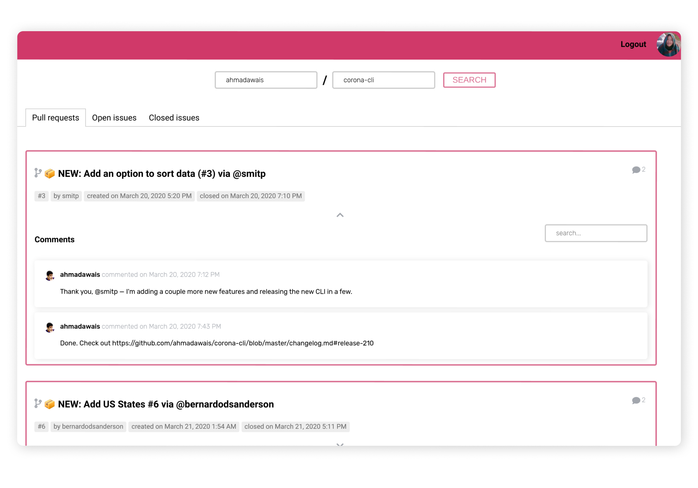

# GIT REPO VIEWER



## Getting started

```
 git clone https://github.com/lydialawli/git-repo-viewer.git
 yarn // or npm install
 yarn start //or npm start
```

## Notes

- Please provide a [valid](https://help.github.com/en/github/authenticating-to-github/creating-a-personal-access-token-for-the-command-line#creating-a-token)
 Github auth token to login, otherwise the searches won't work.

- There are some repository examples suggested which you can test out.

- When using the search bar in the comments section; it compares the user input with the repo section title, comment "body" or the date of creation.


## Task

- [x] Allow end user to input github auth token.
- [x] Display following information regarding a chosen repo (selected via a text input field with user name/repo name. eg. nuwave/lighthouse ) in a tab view:

  - [x] List of pull requests
  - [x] List of open issues
  - [x] List of closed issues

- [x] Clicking on an issue should display a detailed view of the issue including:
  - [x] A list of corresponding comments related to this issue in chronological order
  - [x] A search box for filtering comments (directly in the app, without re-fetching the data)

 no need for pagination!
